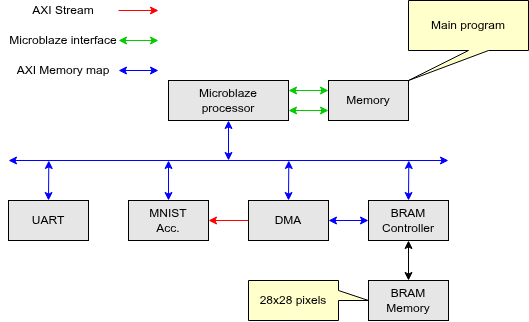
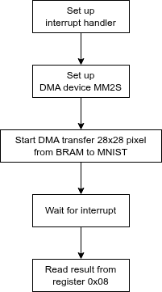

# README

## Overview

This section integrate the MNIST module as a hardware accelerator into Microblaze processor based system. The connection is described as below.

 <!-- markdownlint-disable-line MD033 -->

Memory connecting with Microblaze processor will hold the main code while BRAM memory will store the input image value 28x28 pixels.
DMA will act as a transformer to transfer data input from BRAM memory input MNIST accelearator. After calculation, MNIST will store its result into registers.
An interrupt will be generated by MNIST accelerator. The processor will jump into interrupt handler and display the result.

 <!-- markdownlint-disable-line MD033 -->

## RTL Simulation

To execute the simulation:

```bash
make sim
```

## Note

Change line Line 150 in `microblaze.tcl` pointing to correct folder holding your board file downloaded from: <https://github.com/Digilent/vivado-boards>
