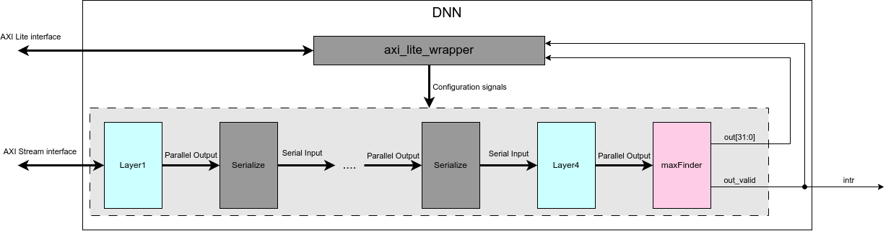
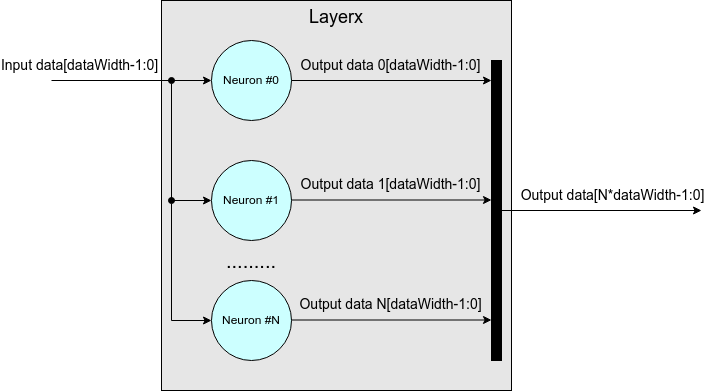
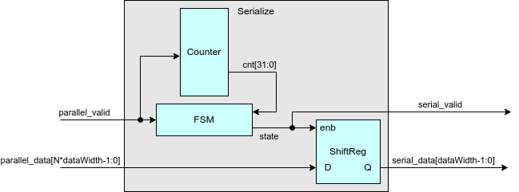
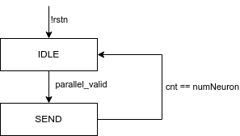

# Design

## Overivew

This document presents implementation of deep neural network with 4 hidden layers: 30, 30, 10 and 10 neurons each layer. Each layer can use ReLU-based activation function or sigmoid function depending on configuration and an output softmax layer, which is used to determine the output neuron with maximum value.

This deep neural network targets the popular **[MNIST dataset](https://www.kaggle.com/datasets/hojjatk/mnist-dataset)**, the goal of which is to recognize the handwriting digit.

The implementation of a neuron is presented in **[neuron](../../neuron/docs/Design.md)**. This document only presents the implementation of each layers , network.

## Inputs/Outputs

The module uses two types of AXI interface: AXI Stream for data, AXI Lite for configuration. Besides, there is an interrupt signal for notifying the completion of recongnization. Based on this signal, CPU could handle the interrupt to get the result of DNN.

|Signal name|Direction|Description|
|---|---|---|
|s_axi_aclk|Input|Input clock|
|s_axi_aresetn|Input|Asynchronous active low reset|
|axis_in_data*|AXI Stream|AXI Stream interface for input data|
|s_axi_*|AXI Lite interface| AXI Lite interface for configuration|
|intr|Output|Interrupt of this module to notify the completion of calculation. Level trigger.|

## Parameters

|Paramter|Default|Description|
|---|---|---|
|C_S_AXI_DATA_WIDTH|32|Data width for AXI Lite interface|
|C_S_AXI_ADDR_WIDTH|5|Address width for AXI Lite interface|

Besides, module also define some parameters in `layer_paramter.sv` for DNN configuration.

|Name|Default|Description|
|---|---|---|
|pretrained|-|All weights and bias of each neurons in DNN are fixed in memory.|
|numlayers|4|Number of hidden layers in this DNN including the output layers|
|dataWidth|16|Data width of data in this DNN|
|numNeuronLayer1|30|Number of neurons in layer 1|
|numWeightLayers1|784|Number of weights in layer 1. Because MNIST dataset uses 28x28 input image|
|Layer1ActType|relu|Activation function for layer 1. It could be relu or sigmoid|
|numNeuronLayer2|30|Number of neurons in layer 2|
|numWeightLayers2|30|Number of weights in layer 2|
|Layer2ActType|relu|Activation function for layer 2. It could be relu or sigmoid|
|numNeuronLayer3|30|Number of neurons in layer 3|
|numWeightLayers3|30|Number of weights in layer 3|
|Layer3ActType|relu|Activation function for layer 3. It could be relu or sigmoid|
|numNeuronLayer4|10|Number of neurons in layer 4|
|numWeightLayers4|10|Number of weights in layer 4|
|Layer4ActType|relu|Activation function for layer 4. It could be relu or sigmoid|
|sigmoidSize|5|Data width of input for sigmoid function. Skip this when choosing relu as activation function|
|weightIntWidth|4|Number of bits in integer part of weight input. You should run training in python to choose the best fit paramter to get the highest correction and smallest resource the implementation gets|

## Detail design

Here is the implementaion of DNN in hardware. There are 3 main components inside module.

 <!-- markdownlint-disable-line MD033 -->

### `axi_lite_wrapper`

`axi_lite_wrapper` is a template module from Vivado, which creates AXI Lite interface for registers. Table below shows registers inside module.

|Register Name|Offset Address|Bit width|Description|
|---|---|---|---|
|weightReg|0x00|32|Weight Value of neuron x in layer y. With x and y defined in neuronReg and layerReg.|
|biasReg|0x04|32|Bias Value of neuron x in layer y. With x and y defined in neuronReg and layerReg.|
|outputReg|0x08|32|Output of this neuron network.|
|layerReg|0x0c|32|Define layer number in which we will set up weight and bias in case these two values are not pre defined.|
|neuronReg|0x10|32|Define neuron number in which we will set up weight and bias in case these two values are not pre defined.|
|axi_rd_data|0x14|32|There are 10 values of 10 neurons in layer 4. Each time we read this register, we will read the value of each neurons in layer 4.|
|staReg|0x18|1|Status of interrupt. When being read, this register will automatically be clear to 0.|
|controlReg|0x1c|1|Write 1 to register will create a soft reset to module.|

`axi_lite_wrapper` will send configuration information to `Layerx` through below signals.

|Signal name|Bit width|Description|
|---|---|---|
|layerNumber|32 bit|Layer number that bias/weight value will be written in.|
|neuronNumber|32 bit|Neuron number that bias/weight value will be written in.|
|weightValue|32 bit|Weight value.|
|biasValue|32 bit|Bias value.|
|softReset|1 bit|Module soft reset.|

### `Layerx`

`Layerx` will instantiate **[neurons](../../neuron/docs/Design.md)** based on its number of neurons. Input data will be serial type because each pixel of 28x28 image will be driven into module through AXI Stream interface. Meanwhile, output of `Layerx` will be parralel output because when one data of input passes into `Layerx`, it will be passed to all neurons at the same time. All neurons in `Layerx` will calculate the output at the same time.

 <!-- markdownlint-disable-line MD033 -->

### `Serialize`

Paralel output of `Layerx` will be serialized by module `Serialize` to be input of the next `Layerx`. Detail implementation of `Serialize` is shown as below.
`parallel_data` will be shifted `dataWidth` bits when `state` is equal to `SEND`. The process of shifting bit will start when parrallel_valid is pulled to `HIGH`.

  <!-- markdownlint-disable-line MD033 -->

## Generate weight and bias

For generating weights and biases for each layer, please use the python code inside `sim/training`

```python
python trainNN.py #To run training mnist, it will generate `WeightsAndBiases.txt`
python genWeightsAndBias.py #To generate weight and bias values from WeightAndBiases.txt in folder w_b
python genTestData.py # To generate test data in folder testData
```

There is a note when generating weight and bias. Because our design has two types of activation function, please change this command according to that choice in file `sim/training/network2.py`.

```python
def sigmoid(z):
    """The sigmoid function."""
    return 1.0/(1.0+np.exp(-z))
    #return np.maximum(z,0)

def sigmoid_prime(z):
    """Derivative of the sigmoid function."""
    return sigmoid(z)*(1-sigmoid(z))
    #return 1. * (z > 0)
```

## RTL Simulation

To run simulation, run the following command:

```bash
make simulate MAXTESTSAMPLES=<number of test input images (maximum 10000)> ACT_FUNC=<activation function choice (RELU/SIGMOID)>
```

Result for 10000 images

|Activation function|Python run|RTL simulation run|
|---|---|---|
|Sigmoid function|96.29%|89.89%|
|Relu function|96.28%|95.01%|
