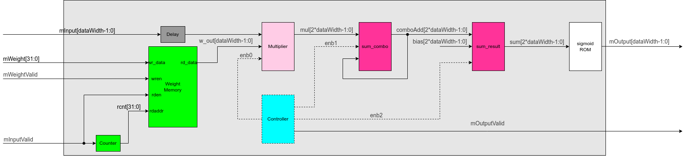

# Design

## Overview

Design implements operation of a sigmoid neuron. Each input values will be multiplied with its predefined weighted value which is stored in Block RAM. Sum of those multiplication will be added with a predefined bias. This result will be passed to a sigmoid function to obtain the final result of neuron:
$S(x) = \frac{1}{1 + e^{-x}}$.

## Inputs/Outputs

|Signal name| Direction| Bit width| Description|
|---|---|---|---|
|clk| Input| 1 Bit| Input clock|
|rstn| Input| 1 Bit| Asynchronous active low reset|
|mInput|Input| DataWidth| Input for sigmoid neuron. Each value of input is represetend in a format of sign magnitude.|
|mInputValid| Input|1 Bit| Signal notifies the avaibility of minput|
|mWeight|Input| 32 Bits| Weighted value of input. Value of weight could be initially stored in Block RAM or be written from outside. Each value of weight is represetend in a format of sign magnitude.|
|mWeightValid| Input|1 Bit| Signal notifies the avaibility of mweight|
|mBias|Input| 32 Bits| Bias value of neuron. Value of bias could be initially stored in Block RAM or be written from outside. Value of bias is represetend in a format of sign magnitude.|
|mBiasValid| Input|1 Bit| Signal notifies the avaibility of mBias|
|config_layer_num| Input|32 Bits|-|
|config_neuron_num| Input|32 Bits|-|
|mOutput| Output| DataWidth| Result of signmoid neuron|
|mOutputValid| Output| 1 Bit| Signal notifies the avaibility of mOutput|

## Parameters

|Name| Default value| Description|
|---|---|---|
|layerNo|0|The neuron belongs to which layer.|
|neuronNo|0|The neuron number in layer.|
|numWeight|784|Size of Weight memory|
|dataWidth|16|Bit width of input and output of this neurons|
|sigmoidSize|5|Bit width of result of sigmoid function|
|weightIntWidth|1|The number of bits used for integer part of weight including the sign bit. For example, when defining 4 for weightIntWidth, 1 bit out of 16 bits used for input and output of this neurons is used for sign and the other 3 bits are used for magnitude.|
|actType|relu|Activation function for layer 3. It could be relu or sigmoid|
|biasFile|-|Initialized bias value|
|weightFile|-|Initialized weight value|

## Detail design

As mentioned in section [Inputs/Outputs](#L10), there are 3 main interfaces for input value, weight value and output value. Each interface has value signal and its valid signal.

When weight value is not initialized at the beginning, it could be written into Weight Memory through this interface. Size of this memory is defined by parameter `numWeight`. Weight Memory is implemented as a Block RAM due to its big size: 2^`dataWidth`*`numWeight`.

After that, every time there is an input going into module, its respective weight value `w_out` is read from Weight Memory. Controller will send a pulse `enb0` to enable multiplier between `w_out` and 1 clock cycle delay value of `mInput`. This is a signed multiplication.

In the next cycle, `enb1` will be HIGH to enable addition between `comboAdd` and `mul`. There is a chance of overflow computation. It happens when:

- `mul` and `comboAdd` are negative but the result between them is postive.
- `mul` and `comboAdd` are positive but the result between them is negative.

Multiplication between weight and input will be added to sum untill the last `numWeight`. At this last value of input, `enb2` will be HIGH in one clock cycle to enable addition between `bias` and `comboAdd` to obtain `sum`. Then, `sum` will be pass to LUT `sigmoid ROM` to get `mOutput` and at the same clock cycle, `mOutputValid` will be HIGH to notify valid of the Output signal.

 <!-- markdownlint-disable-line MD033 -->

 <!-- markdownlint-disable-line MD033 -->
